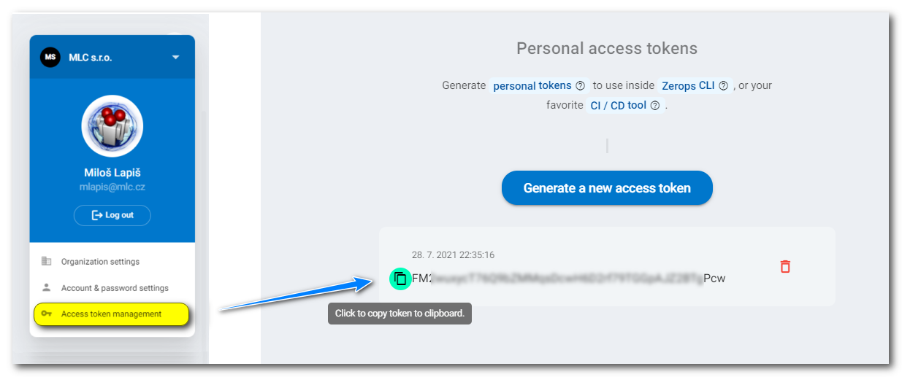

# Authorization

## Login using Personal access token

If you are using zCLI outside of your computer, as in a [GitHub Action](/documentation/deploy/use-in-github-actions.html) or a [GitLab Job](/documentation/deploy/use-in-gitlab-ci.html) you might want to use a **personal access token** to [`log in`](/documentation/cli/installation-authorization.html#login-using-personal-token). These can be created by clicking on your avatar in the top right corner and heading to the **Access token management** page.



After you create your personal access token, you can log in using the command:

```bash
zcli login --zeropsToken=<token> --region=usc1
```

or even shorter, where the token value is used without its flag:

```bash
zcli login <token> --region=usc1
```

or better yet, add `ZEROPSTOKEN` to your environment variables, in which case the token doesn't need to be passed as a parameter. *This is the preferred* and more secure option, as this way, the token doesn't show up in logs.

```bash
zcli login --region=usc1
```

The [region](/documentation/cli/available-commands.html#region) flag specifies the Zerops data center a user logs in. Actually, St. Louis (US) is available, and as such, you have to choose only the value `usc1`.

<!-- markdownlint-disable DOCSMD004 -->
::: tip Log in only once
You only need to log in once. Authorization token will be saved in your `~/.config/zerops/cli.data` folder inside your filesystem (on Mac or Linux platforms), or in `C:\Users\<user>\AppData\Roaming\.config\zerops\cli.data` (on Windows platform).
:::
<!-- markdownlint-enable DOCSMD004 -->