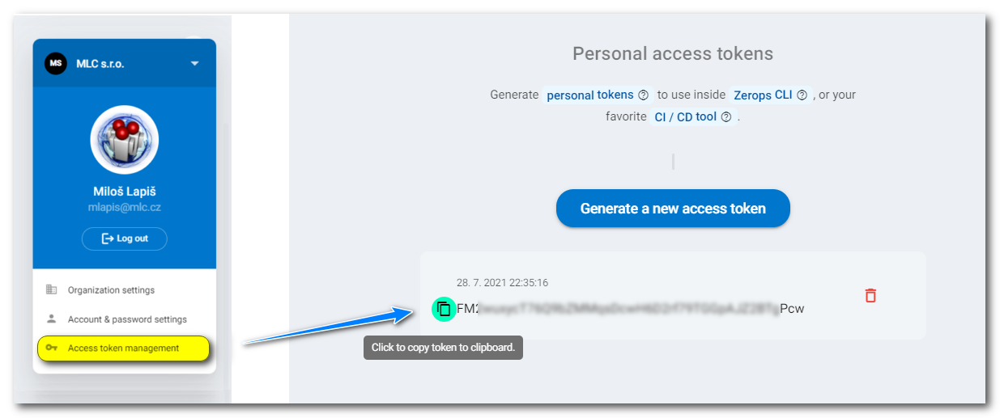

# zCLI Available Commands

[[toc]]

<!--
## `region list`

Lists all available Zerops regions, i.e., the location of data centers where Zerops is operated.
-->

## `login`

Should be used after you install **zcli**. You usually only need to log in once per device.

```bash
zcli login --zeropsToken=<token> --region=<region>
```

### Login parameters

#### `--region`

The required specification to which Zerops data center a user wants to log in. Actually, St. Louis (US) is available, and as such, you have to choose only the value `usc1`.

```bash
zcli login --region=usc1
```

#### `--zeropsToken`

The personal access token you created in the Zerops GUI. It's preferable that the token is passed as the `ZEROPSTOKEN` environment variable, so that it doesn't show up in logs for the security reasons. A command parameter has priority over an environment variable if both equivalents exist.



```bash
zcli login --zeropsToken=AC750cs64sas897sabs65sasbbas9asbdbasd65sadNa
```

<!-- markdownlint-disable DOCSMD004 -->
::: tip Personal access token value without its flag
You can also use the token value directly without the flag `--zeropsToken=`. zCLI recognizes this case correctly.

```bash
zcli login AC750cs64sas897sabs65sasbbas9asbdbasd65sadNa
```

:::
<!-- markdownlint-enable DOCSMD004 -->

## `vpn start [project name]`

Used to establish a secure connection to your protected project network. Requires the `project name` to be defined.

<!-- markdownlint-disable DOCSMD004 -->
::: tip Using quotes
You must enclose the project name in quotes if it contains a space.
:::
<!-- markdownlint-enable DOCSMD004 -->

<!-- markdownlint-disable DOCSMD004 -->
::: warning Other WireGuard running processes
The command `zcli vpn start` should only be run in an environment where no other WireGuard processes are running, otherwise we do not guarantee proper functionality.
:::
<!-- markdownlint-enable DOCSMD004 -->

```bash
zcli vpn start myproject
```

## `vpn stop`

Disconnects the established VPN connection.

```bash
zcli vpn stop
```

## `vpn status`

Prints the current VPN connection status.

```bash
zcli vpn status
```

## `push [project name] [service name]`

It can be used to trigger the [build pipeline](/documentation/build/how-zerops-build-works.html) defined in the project's `zerops.yml`. **By default, it will take into account your `.gitignore`**, therefore the same files that you are tracking in your repository will be used to build the application from your local environment.

<!-- markdownlint-disable DOCSMD004 -->
::: tip Using quotes
You must enclose the project name in quotes if it contains a space.
:::
<!-- markdownlint-enable DOCSMD004 -->

### Push parameters

Only one **push** parameter is optional and can be used both as a parameter `--parameterName` or can be put inside your environment variable as `PARAMETERNAME`. A command parameter has priority over an environment variable if both equivalents exist.

#### `--versionName` for the push command

Will be used to name the resulting [deployed](/documentation/deploy/how-deploy-works.html) application version.

<!-- markdownlint-disable DOCSMD004 -->
::: tip Using quotes
You must enclose the version name in quotes if it contains a space.
:::
<!-- markdownlint-enable DOCSMD004 -->

```bash
zcli push myproject myservice --versionName=v0.0.1
```

## `deploy [project name] [service name] [space separated files or directories]`

It is used to deploy directories and files to the Zerops service as an alternative to the [push](#push-project-name-service-name) command. Use when you want to deploy files that have already built by any means directly into a Zerops service runtime container. In such a case, you don't need the `zerops.yml` configuration file.

<!-- markdownlint-disable DOCSMD004 -->
::: tip Using quotes
You must enclose the project name in quotes if it contains a space.
:::
<!-- markdownlint-enable DOCSMD004 -->

<!-- markdownlint-disable DOCSMD004 -->
::: tip Using a tilda character to strip a path directory of deployed files
Standard behavior is to copy the directories and files with exactly the same path as they are placed in the source location. If you want to strip the path from the left side, use the tilda (**~**) character. You can strip the entire directory path or only its part from the left.
:::
<!-- markdownlint-enable DOCSMD004 -->

### Example

If, for example, your built application is located in the folder `dist/app` and you want to deploy the files inside it without the directory path, you can use ==`./dist/app/~/`== pattern.

```bash
zcli deploy myproject myservice ./dist/app/~/
```

<!-- markdownlint-disable DOCSMD004 -->
::: tip Using quotes
You must enclose the pattern in quotes if the directory path contains a space.
:::
<!-- markdownlint-enable DOCSMD004 -->

You can see more pattern examples in the `zerops.yml` [deploy property](/documentation/build/build-config.html#examples-of-different-deploy-settings) documentation. Here, you can use the same patterns (without the enclosed array but with a space as a separator).

### Deploy parameters

Only one **deploy** parameter is optional and can be used both as a parameter `--parameterName` or can be put inside your environment variable as `PARAMETERNAME`. A command parameter has priority over an environment variable if both equivalents exist.

#### `--versionName` for the deploy command

Will be used to name the resulting [deployed](/documentation/deploy/how-deploy-works.html) application version.

<!-- markdownlint-disable DOCSMD004 -->
::: tip Using quotes
You must enclose the version name in quotes if it contains a space.
:::
<!-- markdownlint-enable DOCSMD004 -->

```bash
zcli deploy myproject myservice --versionName=v0.0.1 ./dist/app/~/
```
